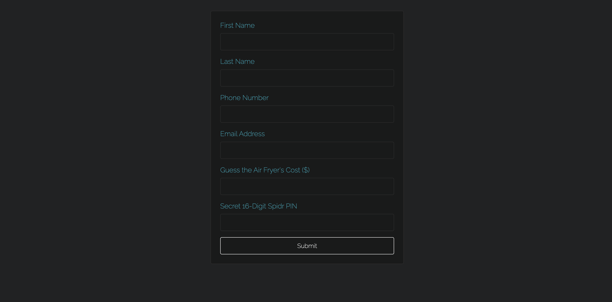

# Spidr Design: Interest Form Challenge

This project is a front-end coding challenge completed for a Full-Stack Software Engineer position at Spidr Design. The objective was to build a single-page interest form for a fictitious new air fryer, meticulously emulating the company's brand style.

The form is built with React and demonstrates a clean, modern UI with a focus on component-based architecture and a high-quality user experience.

---

### **[➡️ Live Demo Link](http://spidr-form-seonghoon-20250715.s3-website-us-east-1.amazonaws.com/)**

---

## Screenshot




---

## Features

-   **Responsive Design:** A clean layout that adapts to different screen sizes.
-   **Controlled Components:** All form inputs are controlled by React state (`useState` hook) for robust data management.
-   **Input Masking:** Real-time, user-friendly input masking for the Phone Number and Spidr PIN fields, implemented with `react-imask`.
-   **Dynamic Styling:** All styling is handled via `styled-components` with a centralized `theme.js` file for brand consistency and easy maintenance.
-   **Console Data Submission:** On submission, the form data is cleanly logged to the browser console.

---

## Technologies Used

-   **React:** For building the user interface.
-   **Vite:** As the build tool and development server.
-   **styled-components:** For all CSS-in-JS styling and theming.
-   **react-imask:** For the input masking functionality.

---

## Getting Started (Local Setup)

To clone this project and run it on your local machine, follow these steps.

1.  **Clone the repository:**
    ```bash
    git clone [https://github.com/YOUR_USERNAME/YOUR_REPOSITORY_NAME.git](https://github.com/YOUR_USERNAME/YOUR_REPOSITORY_NAME.git)
    ```

2.  **Navigate into the project directory:**
    ```bash
    cd spidr-interest-form
    ```

3.  **Install dependencies:**
    ```bash
    npm install
    ```

4.  **Start the development server:**
    ```bash
    npm run dev
    ```
    The application will be running at `http://localhost:5173`.

---

## Deployment

This application was deployed as a static website using **AWS S3**. The process involved:
1.  Creating a production build with `npm run build`.
2.  Configuring an S3 bucket for static website hosting.
3.  Setting the correct public access permissions and bucket policies.
4.  Uploading the contents of the `/dist` folder to the S3 bucket.

---

